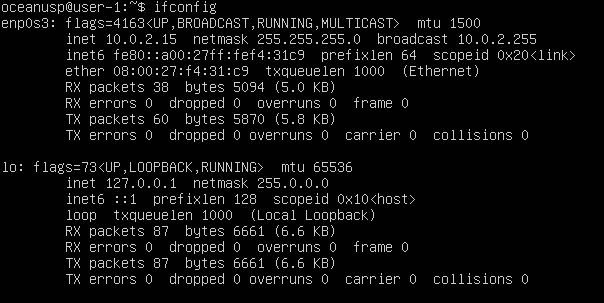
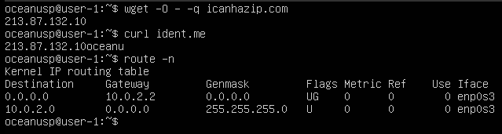
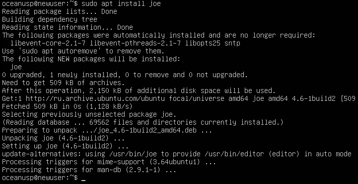
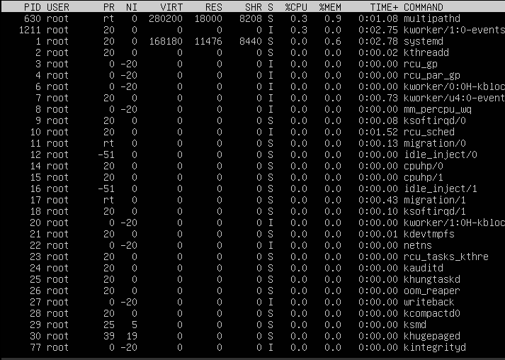
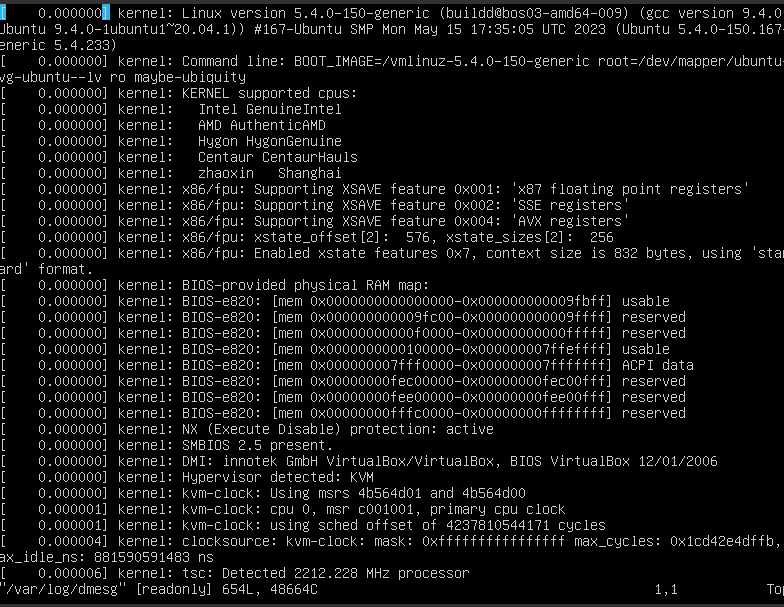
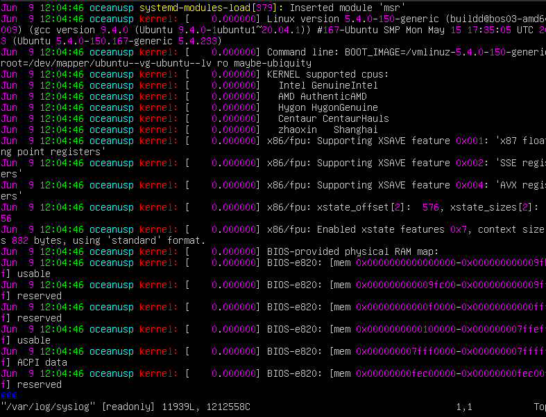
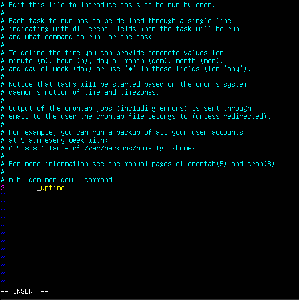

# Операционные системы UNIX/Linux (Базовый).

## Part 1. Установка ОС
**1. Установлен **Ubuntu 20.04 Server LTS** без графического интерфейса. (Использую программу для виртуализации - VirtualBox).Команда для просмотра`cat /etc/issue`**

## Part 2. Создание пользователя

**1. Создаю нового пользователя командой ``sudo useradd -G adm new_user``**

**2. Просматриваю нового пользователя ``cat /etc/passwd``**

## Part 3. Настройка сети ОС

**1. Задаю название машины вида user-1  с помощью команды `sudo vim /etc/hostname` и `sudo vim /etc/hosts`**

**2. Устанавливаю временную зону командой  `sudo timedatectl set-timezone Europe/Moscow`** 

**3. Проверяю командой `timedatectl` все ли корректно установилось**

**4.  Вывожу названия сетевых интерфейсов с помощью консольной команды `` ifconfig``**

- lo (loopback device) – виртуальный интерфейс, присутствующий по умолчанию в любом Linux. Он используется для отладки сетевых программ и запуска серверных приложений на локальной машине.

**5. Сбрасываю свой старый ip адрес командой `sudo dhclient -r enp0s3`**

**6. И получаю новый командой `sudo dhclient -v enp0s3`**

**7. Проверяю все это командой `ifconfig`**

- Dynamic Host Configuration Protocol (DHCP) — автоматический предоставляет IP адреса и прочие настройки сети (маску сети, шлюз и т.п) компьютерам и различным устройствам в сети. Клиент настроенный на получение адреса по протоколу DHCP посылает запрос к серверу, и тот в свою очередь предоставляет свободный IP адрес клиенту во временное пользование.

**8. Определяю и вывожу на экран внешний ip-адрес шлюза (ip) командой  `wget -O - -q icanhazip.com` либо curl ident.me (предварительно установивив  curl ) и внутренний IP-адрес шлюза, он же ip-адрес по умолчанию (gw) командой `route -n`**

**9. Задаю статичные настройки ip, gw, dns, для этого открываю файл /00-installer-config.yaml для редактирования командой `sudo vim /etc/netplan/00-installer-config.yaml`, отключаю получение адресов от DHCP и присваиваю свой статический адрес**

- файл 00-installer-config.yaml - было: 

- файл 00-installer-config.yaml - стало: 

**10. `sudo netplan apply` - для применения конфигураций**

**11. `sudo netplan try` - для применения изменений**

**12. `ifconfig` - проверяем получили ли мы статистические настройки**

**13. `ping -c 10 ya.ru` - и убеждаемся что все работает и нет потери пакетов**

## Part 4. Обновление ОС

**1. `sudo apt update` - обновляю Ubuntu**

**2. `sudo apt dist-upgrade` - обновляю версию пакетов**

**3. И `sudo apt update` проверю на обновление**

## Part 5. Использование команды **sudo**

**1. Команда sudo - позволяет строго определенным пользователям выполнять указанные программы с административными привилегиями без ввода пароля суперпользователя root**

**2. `sudo touch /etc/sudoers.d/new` - создаю файл для нового пользователя**

**3. `sudo vim /etc/sudoers.d/new` - открываю в вим и записываю такую строку `new ALL=(ALL:ALL) ALL`**

**4. Потом перехожу в нового пользователя командой su new_user**

**5. `sudo vim /etc/hostname` - меняю название машины на  new_user**

**6. Перезапускаю виртуальную машину и вижу, что все изменилось как нам и надо было.**

 

## Part 6. Установка и настройка службы времени

**1. `sudo apt install -y ntp` - Устанавливаю NTP протокол для синхронизации времени**

**2. `ntpq -p` - Проверяю, что `ntp` подключён к серверам времен**

**5. `sudo systemctl stop ntp` - остановил нашу команду**

**6. `sudo ntpd -gq` - и принудительно синхронизирую все это**

**7. `sudo systemctl start ntp` - снова все запускаю**

**8. `apt install systemd-timesyncd` - устанавливаю утилиту запуска синхронизации**

**9. `timedatectl set-ntp true` - этой командой запускаю синхронизацию**

**10. `timedatectl show` - и в конце проверяею, что все работает и синхронизируется**

## Part 7. Установка и использование текстовых редакторов 

###VIM-------------------------------------------

**1. `sudo vim test_VIM.txt` - создаю `.txt` файл и открываю его для записи**

**2. Нажимаю `i` чтобы войти в режим редактирования**

**3. Пишу свой ник `oceanusp`**

**4. Нажимаю `:wq` чтобы оно сохранилось и вышло. Затем проверяю сохранилась ли надпись с помощью команды `cat test_VIM.txt`**

**5. Снова открываю файл как в пунктк 1 и вхожу в режим редактирования как в пункте 2**

**6. Меняю `oceanusp` на `21 School 21`**

**8. Нажимаю `escape`**

**9.  Нажимаю `:q!` и выхожу без сохранения**

**10. Проверяю командой `cat test_VIM.txt` что изменения не были сохранены**

**11. Для поиска и замены нам понадобится открыть файл**

**12. Нажать `escape` и ввести `:s/искомое слово/слово на которую мы заменим/g` - этот флаг отвечает за то чтобы во всем текстовом файле искомое слово заменили. В моем файле я поменял "usp" на  "zameenaa".**

**13. Сохраняем и выходим**

###JOE-------------------------------------------

**1. `sudo apt install Joe` - скачиваю `Joe` текстовый редактор.**

**2. `sudo Joe test_JOE.txt` - создаю .txt файл и открываю его для записи**

**Записал все что мне нужно**

**3. `control+k` а потом нажимаю `Q` и он спросит сохранить изменения.**

**я нажимаю кнопку y и он все сохранит и выйдет**

**Тут же проверяю сохранилась ли запись прочитав ее с помощью "cat"**

**4. Снова открывю файл и меняю содержимое на `21 School 21`, но уже без сохраниния -  буква y**

**Проверяю, что файл, остался без изменений**

**5. Для поиска я нажимаю `control+k` и потом `f`**

**6. Далее пишу исомое слово и `enter` И нам показывают еще несколько команд, из них нам понадобиться только `R`**

**7.Пишу слово на которое мы заменим в моем случае это `zamenaJOE`**

**8. Сохраняю и выхожу**

**Проверяю, что текст изменился**

###NANO------------------------------------------------
**1. `sudo nano test_NANO.txt` - создаю `.txt` файл и открываю его для записи**

**2. Записываю. Нажимаю команду `control+x`**

**3. Меня спрашивают сохранить изменения? Я пишу `y` и нажимаю кнопку `enter`**

**И он сохраняет и выходит.**

**Проверяю сохранилась ли запись**

**4.Снова открываю файл и переписываю его на 21 Shooll 21**

**а не сохранения изменений аналогично но вместо `y` нужно нажать кнопку `n` и `enter`**

**Сразу проверяю содержимое файла**

**5. Для того чтобы он произвел поиск и замену текста мы нажимаем `control+\`**

**6. Внизу (как на фото) появится поле для слова, которое мы ищем. В моем случае это `usp`**

**7. И нажимаю `enter`**

**8. У нас появился еще одно меню. В этот раз в то же место мы записываем слово на которое хотим поменять, в моем случае это `zamenaNANO`**

**9. Спрашивает заменить? Мы говорим да и жмем кнопку `y`**

**10. И сохраняем и выходим, как в пунктах выше**
**И смотрим наш конечный файл**

## Part 8. Установка и базовая настройка сервиса **SSHD**

**1. Устананавливаю службу SSHd с помощью команды: `sudo apt-get install openssh-server`**

**2. Добавляю автостарт службы при загрузке системы.**

**Для включения автостарта службы воспользуемся командой: `sudo systemctl enable ssh`**

**3.Перенастраиваю службу SSHd на порт 2022.**
**Для этого открываю файл конфигурации с помощью команды: `vim /etc/ssh/sshd_config`**
**Нашел строку, определяющую порт: Port 22, поменял его на 2022 и раскомментировал строку.**

> ps (от англ. process status) — программа в Unix-подобных операционных системах, выводящая отчёт о работающих процессах. Ключ -А (-е) позволяет вывести все процессы.

**4. Сохранил и перезапустил командой `sudo service sshd restart` и проверю командой `sudo service sshd status`**

**5.Проверяю статус фаервола командой `sudo ufw status` он был  отключен ( по умолчанию) `inactive`, я исправил это командой `sudo ufw enable`**

**6. Открываю порт командой `sudo ufw allow 2022` и еще раз проверяю статус**

**9. Перезапускаю систему командой  `sudo reboot`**

**10. Скачиваю утилиты netstat `sudo apt install net-tools`**

**11. Вывод команды  `netstat -tan`**

>netstat (network statistics) — утилита командной строки, выводящая на дисплей состояние TCP-соединений (как входящих, так и исходящих), таблицы маршрутизации, число сетевых интерфейсов и сетевую статистику по протоколам. Основное назначение утилиты — поиск сетевых проблем и определение производительности сети.

#### Используемые ключи:
* t (--tcp) - показывать только TCP порты.
* a (--all) - показывать состояние всех сокетов.
* -n (--numeric) - показывать сетевые адреса как числа (например 127.0.0.53:53 вместо localhost:domain)

#### Значения столбцов 
* Proto - протокол, используемый сокетом. Так как была использована опция [-t|--tcp], в выводе пристутвуют только TCP-сокеты.
* Recv-Q - счётчик байт, не скопированных программой пользователя из этого сокета.
* Send-Q - счётчик байтов, не подтверждённых удалённым узлом.
* Local Address - адрес и номер порта локального конца сокета. Если указана опция [-n|--numeric], вывод в формате [адрес сокета:номер порта], иначе - [каноническое имя узла:соответствующее имя службы]. В интересующей нас строчке 0.0.0.0 - адрес локального конца сокета, 2022 - номер порта, который мы поменяли с 22 на 2022. Адрес 0.0.0.0 означает, что удаленный конец сокета будет доступен всем локальным ip-адресам.
* Foreign Address - адрес и номер порта удалённого конца сокета.
* State - состояние сокета. Состояние LISTEN означает, что сокет ожидает входящих подключений.
  

## Part 9. Установка и использование утилит **top**, **htop**

**1. Установка `sudo apt install top/htop`.**

**2. Запускаю `top`.**

* uptime - 19min
* количество авторизованных пользователей - 1
* общую загрузку системы(load avarage) - 0.00, 0.00, 0.00
* общее количество процессов(Tasks) - 110 total, 1 running, 104 sleeping, 5 stopped, 0 zombie
* загрузка cpu - 0,0 us, 0,0 su, 0,0 ni, 99,7 id, 0,3 wa, 0,0 hi, 0,0 si, 0,0 st
* загрузка памяти (Mib Mem) - 1983,2 total, 1417,0 free, 162,8 used, 403.3 buff/cache
* pid процесса занимающего больше всего памяти - 1374
* pid процесса, занимающего больше всего процессорного времени - 3

**2. отсортировка по `PID`**
**Для сортировки по нужному параметру нажимаю `shift + F`, стрелочками перемещаюсь к нужному параметру и нажимаю `S` и `Q`.**

**3. отсортировка по `PERCENT_CPU`**

**4. отсортировка по `PERCENT_MEM`**

**5. отсортировка по `TIME`**

**Для фильтрации по нужному параметру нажимаю `O`, пишу команду `COMMAND=sshd` и нажимаю ENTER. Анологично филтрую и по другим процессам.**

**6. отфлиртованный процесс `sshd`**

**7. `syslog`**

**8. с добавление `hostname, clocl, uptime`**

 

## Part 10. Использование утилиты **fdisk**

**1. Запускаю команду `fdisk -l`** 

**`/dev/sda 10.53GIB, 11296309248 bytes, 22063104 sector`**

* Имя /dev/sda
* Размер 10.53 Гб
* Колличество секторов 22063104
* Размер swap 1.6 Gb 
> Узнать размер swap можно с помощью команды `free -h`

## Part 11. Использование утилиты **df** 

**1. Для корневого раздела запускаю команду `df /`**

* размер раздела - 8944644
* размер занятого пространства - 4379708
* размер свободного пространства - 40889884
* процент использования - 52%
* Единица измерения в выводе: Килобайт

**2. Для корневого раздела с командой `df -Th /`**

* размер раздела - 8,6G**
* размер занятого пространства - 4,2G
* размер свободного пространства - 3,9G
* процент использования - 52%
* тип файловой системы для раздела : ext4

## Part 12. Использование утилиты **du**
-Команда du позволяет задействовать одноименную утилиту, предназначенную для вывода информации об объеме дискового пространства, занятого файлами и директориями. Она принимает путь к элементу файловой системы и выводит информацию о количестве байт дискового пространства или блоков диска, задействованных для его хранения.

**1. Вывожу в байтах без без символьных ссылок командой `du -B1 -d0 /home /var /var/log`**

**Вывожу в человеческом виде без без символьных ссылок командой `du -h -d0 /home /var /var/log`**

**2. РВывожу размер всего содержимого в /var/log.**

## Part 13. Установка и использование утилиты **ncdu**

**1. Устанавливаю  командой `sudo apt install ncdu`**

**2. `/home`**

**3. `/var`**

**4. `/var/log`**

## Part 14. Работа с системными журналами

**`/var/log/dmesg` содержит информацию о драйверах устройств**

**`/var/log/auth.log` информация об авторизации пользователей, включая удачные и неудачные попытки входа в систему, а также задействованные механизмы аутентификации.**

**`/var/log/syslog` одержит глобальный системный журнал, в котором пишутся сообщения от ядра Linux, различных служб, сетевых интерфейсов и т.д. с момента запуска системы.**

**Информация об последней успешной авторизации: `sudo cat /var/log/auth.log | grep login`**

**Перезапустил SSHd службу `sudo systemctl restart ssh` и нашел логи в `/var/log/syslog`**

[sshd](images/14_6.png)

## Part 15. Использование планировщика заданий **CRON**

**1. Устанавливаю cron `sudo apt install cron`**

**2. Для создания задачи я открыл файл планировщик командой `crontab -e` и вписалл следующую строку */2 * * * * uptime. Далее `crontab -l` позволяет посмотреть этот файл**

**2. Записи в /var/log/syslog:**

**3. Удаляю конфигурационный файл: `crontab -r`  и пытаюсь вывести список задач после удаления**

**Для нас нет списка задач, все отработало корректно, так как минутой ранее я этот список удалил.**
